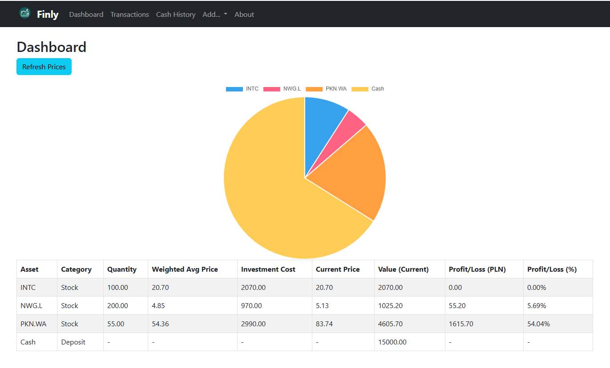
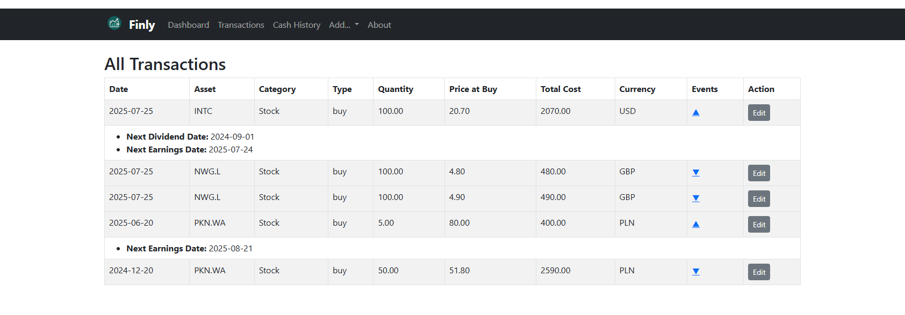

#  Finly Portfolio Tracker


---

**Finly** is a modern, self-hosted portfolio tracker built with Python, Flask, and SQLite—perfect for personal finance enthusiasts, DIY investors, and tinkerers.  
Track your stocks, ETFs, bonds, crypto, and cash deposits, with powerful dashboards and analytics—all running privately on your own Raspberry Pi or server.

---

## 🚀 Features

- 📈 **Live Portfolio Dashboard**  
  Get real-time updates, interactive charts, and clear summaries of your holdings, allocations, and profit/loss.
- 💸 **Multi-Asset Tracking**  
  Manage stocks, ETFs, bonds, crypto, and cash—add and edit any transaction.
- 🌍 **Automatic FX and Price Updates**  
  Pulls the latest prices and currency rates automatically (with caching to avoid API limits).
- 💵 **Dividend Intelligence**  
  Fetches upcoming payouts and history from Twelve Data + EOD, normalizes net/gross values, and surfaces them in a dedicated view.
- 🪙 **Bond Ledger**  
  Track Polish retail bonds (or add your own), with accrued interest calculations, dashboards, and amortization helpers.
- 📝 **Full Transaction and Cash History**  
  See every trade, deposit, and cash change—edit, audit, and analyze with ease.
- 📅 **Upcoming Events**  
  Track dividend dates, earnings, and key events for your holdings (when available).
- 🛡 **Your Data, Your Control**  
  All information stays on your hardware—no cloud, no tracking, fully private.
- 🎨 **Responsive Web UI**  
  Bootstrap styling, dark navbar, and custom logo support for a sleek, modern look.

---

## 📷 Screenshots

> *Add screenshots of your dashboard, add-transaction page, and charts here!*
>
>   
> 

---

## 🏁 Quick Start

### 1. **Clone the repo**

```bash
git clone https://github.com/aroods/finly.git
cd finly
```

### 2. **Install dependencies**

> *(Recommended: use a virtual environment)*

```bash
python3 -m venv venv
source venv/bin/activate
pip install -r requirements.txt
```

### 3. **Configure environment**

Copy the sample `.env` and fill in your API keys (see [🔑 Environment & API Keys](#-environment--api-keys)):

```bash
cp .env.example .env
```

### 4. **Run locally**

```bash
python app.py
```

Then open [http://localhost:5000](http://localhost:5000) in your browser.

---

## 🐳 Run with Docker

```bash
docker build -t finly:latest .
docker run -d --name finly -p 5000:5000 \
  -v "$PWD/portfolio.db:/app/portfolio.db" \
  finly:latest
```

- Edit your `portfolio.db` directly, or let the app manage your transactions.
- The UI is available at [http://localhost:5000](http://localhost:5000).

---

## ⚙️ Configuration

- **Environment Variables:** defined in `.env`
  - `SECRET_KEY` — Session protection (optional but recommended).
  - `TWELVE_DATA_API_KEY` — Required for dividend data.
  - `EOD_API_KEY` — Required for dividend fallback and fundamentals.
- **Logo:** Place your custom logo in `static/logo.png` (shown in navbar and About).
- **Docker refresh:** use `./refresh_docker.sh` to rebuild the container with updated code and automatically pass through `.env`.

---

## 📦 Modules

- **Dashboard & Analytics** — consolidated performance tiles, allocation drill-down, and profit timeline.
- **Transactions / Equities** — CRUD for equity trades, position summaries, and FX-normalized returns.
- **Bonds** — add Polish treasury bonds with dynamic coupon indexing and auto-accrual.
- **Dividends** — upcoming & historical payouts with net/gross, yield, and caching-aware refresh actions.
- **Cash** — deposits and withdrawals with balance tracking.

---

## 🔑 Environment & API Keys

| Service        | Variable               | Notes & Limits |
|----------------|------------------------|----------------|
| Twelve Data    | `TWELVE_DATA_API_KEY`  | Free tier: 8 requests/min, 800/day. Used for dividend feed. Cache TTL 12h to stay within limits. |
| EOD Historical | `EOD_API_KEY`          | Free tier: 20 requests/day (trial) / paid for more. Used as fallback + fundamentals. Cache TTL 12-24h. |

- For local runs, set keys directly in `.env`. Docker users can rely on `docker run --env-file .env` via `refresh_docker.sh`.
- Clear cached data from the dashboard ⚙ menu when troubleshooting stale quotes or dividends.

---

## 📁 Project Structure

```
finly/
├── app.py
├── db.py
├── helpers.py
├── requirements.txt
├── routes/
├── static/
├── templates/
├── portfolio.db
└── Dockerfile
```

---

## 🙋 FAQ

**Q: Can I use this on a different device/server?**\
A: Yes! It runs anywhere Python and Docker are supported—PC, server, NAS, or Pi.

**Q: How do I update prices without API limits?**\
A: Finly caches prices for 5–10 minutes. You can trigger a manual refresh from the dashboard.

**Q: How do I add new asset types or analytics?**\
A: The app is modular—just add new categories, pages, or helpers as needed.

---

## 👨‍💻 Contributing

PRs and ideas welcome! See `CONTRIBUTING.md` (or open an issue).

---

## 📝 License

MIT License

---

**Finly** — Your investments, your rules, your data.